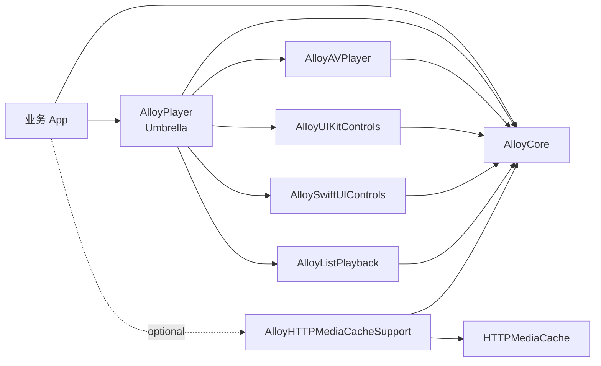
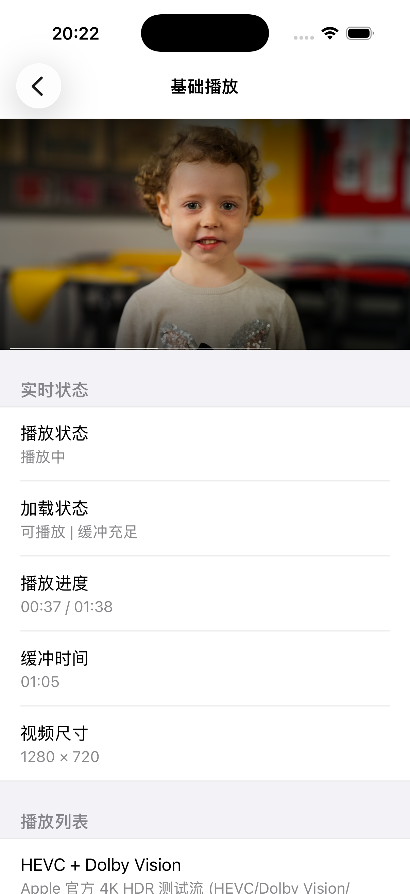
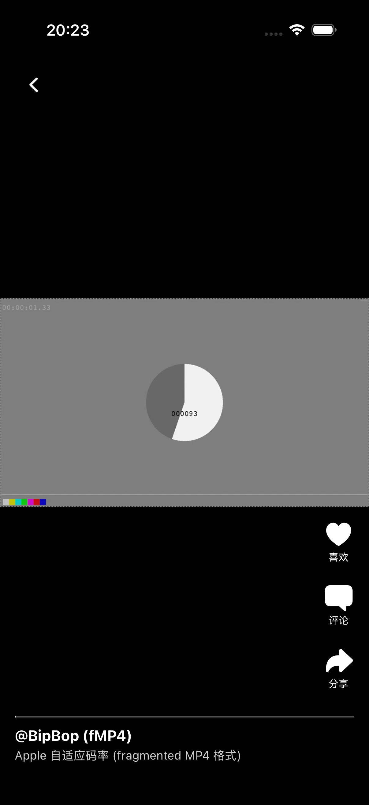
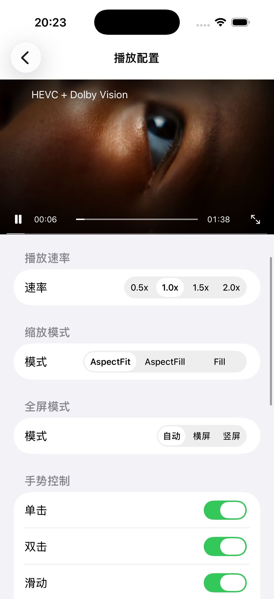
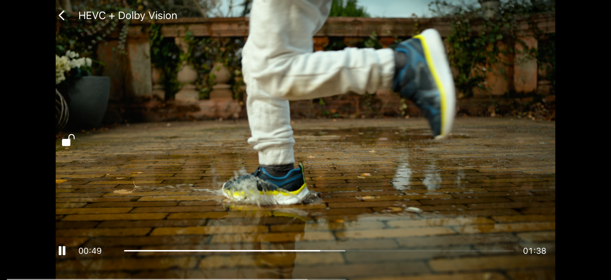
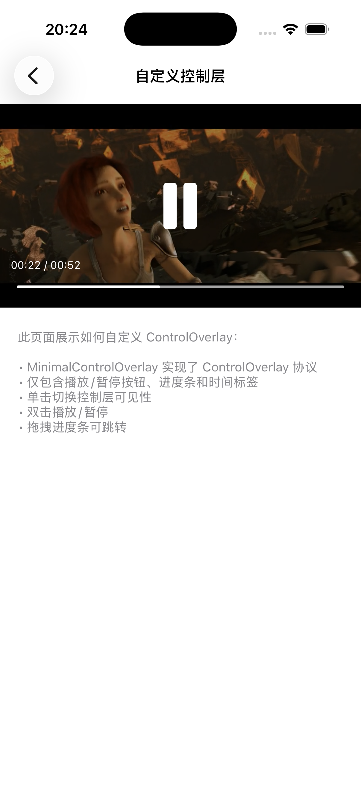

# AlloyPlayer

[](https://github.com/sunimp/AlloyPlayer/actions/workflows/ci.yml)
[](https://github.com/sunimp/AlloyPlayer/releases)
[](Package.swift)
[](Package.swift)
[](Package.swift)
[](LICENSE)

AlloyPlayer 是一个 Swift-only 的现代视频播放器框架。它基于 AVFoundation、Combine、UIKit 和 SwiftUI 构建，提供可插拔播放引擎、控制层协议、列表播放、全屏转换、手势控制和可选 HTTPMediaCache 代理缓存支持。

## 特性

- 纯 Swift Package Manager 分发，核心模块可按需组合。
- 内置 AVFoundation 播放引擎，也可以自行实现 `PlaybackEngine`。
- 内置 UIKit 控制层和 SwiftUI 播放器视图，也可以自行实现 `ControlOverlay`。
- 支持竖屏全屏、横屏全屏、自动旋转、锁定方向和自定义转场。
- 支持单击、双击、拖动、捏合、长按等播放器手势。
- 支持 ScrollView、TableView、CollectionView 列表播放和浮动画中画窗口。
- 播放状态、加载状态、播放时间、缓冲时间、错误和尺寸变化均提供 Combine 发布者。
- 支持网络可达性监控、缓冲提示、音量/亮度 HUD、网速显示和自定义状态栏。
- 可选接入 `AlloyHTTPMediaCacheSupport`，通过 HTTPMediaCache 本地代理实现边播边缓存。
- 支持 iOS 播放场景，并提供 macOS Swift Package 测试宿主。

## 环境要求

- iOS 15.0+
- macOS 12.0+（Swift Package 测试宿主）
- SwiftPM 5.10+
- Xcode 16.0+

## 安装

在 `Package.swift` 中添加依赖：

```swift
.package(url: "https://github.com/sunimp/AlloyPlayer.git", from: "0.2.0")
```

完整播放器能力可以直接添加 `AlloyPlayer`：

```swift
.target(
    name: "YourApp",
    dependencies: [
        .product(name: "AlloyPlayer", package: "AlloyPlayer"),
    ]
)
```

如果需要按模块拆分，可以只引入所需产品：

```swift
.target(
    name: "YourApp",
    dependencies: [
        .product(name: "AlloyCore", package: "AlloyPlayer"),
        .product(name: "AlloyAVPlayer", package: "AlloyPlayer"),
        .product(name: "AlloyUIKitControls", package: "AlloyPlayer"),
        .product(name: "AlloySwiftUIControls", package: "AlloyPlayer"),
    ]
)
```

需要 HTTPMediaCache 缓存播放时，再显式添加可选产品：

```swift
.target(
    name: "YourApp",
    dependencies: [
        .product(name: "AlloyPlayer", package: "AlloyPlayer"),
        .product(name: "AlloyHTTPMediaCacheSupport", package: "AlloyPlayer"),
    ]
)
```

## 迁移指南

从旧版 API 升级时，破坏性变更和 old-to-new 示例见 [迁移指南](docs/MigrationGuide.md)。

## 快速开始

创建播放器、绑定容器视图，并设置视频 URL：

```swift
import AlloyPlayer
import UIKit

final class PlayerViewController: UIViewController {
    private var player: Player!

    override func viewDidLoad() {
        super.viewDidLoad()

        let containerView = UIView(frame: CGRect(x: 0, y: 0, width: view.bounds.width, height: 220))
        view.addSubview(containerView)

        let engine = AVPlayerManager()
        engine.shouldAutoPlay = true

        player = Player(engine: engine, containerView: containerView)
        player.controlOverlay = DefaultControlOverlay()
        player.addDeviceOrientationObserver()
        player.assetURL = URL(string: "https://example.com/video.mp4")
    }

    override func viewWillDisappear(_ animated: Bool) {
        super.viewWillDisappear(animated)
        player.isViewControllerDisappear = true
    }

    override func viewWillAppear(_ animated: Bool) {
        super.viewWillAppear(animated)
        player.isViewControllerDisappear = false
    }
}
```

监听播放状态：

```swift
player.playbackStatePublisher
    .sink { state in
        print("playback state:", state)
    }
    .store(in: &cancellables)

player.playTimePublisher
    .sink { time in
        print("current:", time.current, "total:", time.total)
    }
    .store(in: &cancellables)
```

## HTTPMediaCache 缓存播放

`AlloyHTTPMediaCacheSupport` 是独立可选产品。开启后，业务传入原始 URL，支持层会启动 HTTPMediaCache 本地代理、生成代理 URL，并交给播放器播放：

```swift
import AlloyHTTPMediaCacheSupport
import AlloyPlayer

let originalURL = URL(string: "https://example.com/video.mp4")!
let configuration = AlloyHTTPMediaCacheConfiguration(
    requestHeaders: [
        "Authorization": "Bearer token",
    ]
)

let proxyURL = try await AlloyHTTPMediaCacheSupport.prepare(
    player: player,
    originalURL: originalURL,
    configuration: configuration
)
print("proxy URL:", proxyURL)
```

如果业务只需要代理 URL，也可以自行赋值：

```swift
let proxyURL = try await AlloyHTTPMediaCacheSupport.proxyURL(
    for: originalURL,
    configuration: .default
)
player.assetURL = proxyURL
```

AVPlayer 访问的是本地代理 URL，源站请求由 HTTPMediaCache 发出。鉴权、追踪等源站请求头应通过 `AlloyHTTPMediaCacheConfiguration.requestHeaders` 显式下发到下载链路。

## SwiftUI

`AlloyPlayerView` 提供开箱即用的 SwiftUI 播放器视图：

```swift
import AlloyPlayer
import SwiftUI

struct PlayerScreen: View {
    let url: URL

    var body: some View {
        AlloyPlayerView(url: url)
            .autoPlay(true)
            .scalingMode(.aspectFit)
            .controlAutoHideInterval(2.5)
            .aspectRatio(16.0 / 9.0, contentMode: .fit)
    }
}
```

需要外部控制或自定义控制层时：

```swift
struct CustomPlayerScreen: View {
    @StateObject private var controller = AlloyPlayerController()
    let url: URL

    var body: some View {
        AlloyPlayerView(url: url, controller: controller) { state in
            Button(state.isPlaying ? "暂停" : "播放") {
                state.playOrPause()
            }
        }
        .disabledGestures([.pinch])
        .configurePlayer { player in
            player.isAllowOrientationRotation = true
        }
    }
}
```

## 列表播放

TableView / CollectionView 场景使用 `AlloyListPlayback` 选择最适合播放的可见项，再驱动 `Player` 播放：

```swift
import AlloyPlayer

final class ListPlayerViewController: UIViewController, UITableViewDelegate {
    private var player: Player!
    private var listPlayback: ListPlaybackCoordinator!
    @IBOutlet private var tableView: UITableView!

    override func viewDidLoad() {
        super.viewDidLoad()

        let engine = AVPlayerManager()
        player = Player(engine: engine, containerView: UIView())
        player.controlOverlay = DefaultControlOverlay()
        listPlayback = ListPlaybackCoordinator(player: player)
    }

    func tableView(_ tableView: UITableView, didSelectRowAt indexPath: IndexPath) {
        guard let cell = tableView.cellForRow(at: indexPath) else { return }
        let url = URL(string: "https://example.com/video\(indexPath.row).mp4")!
        let candidate = ListPlaybackCandidate(
            indexPath: indexPath,
            frame: cell.frame,
            assetURL: url
        )
        listPlayback.play(candidate, in: cell.contentView)
    }

    func scrollViewDidEndDecelerating(_ scrollView: UIScrollView) {
        let visibleItems = tableView.indexPathsForVisibleRows?.compactMap { indexPath -> (ListPlaybackCandidate, UIView)? in
            guard let cell = tableView.cellForRow(at: indexPath) else { return nil }
            let frame = tableView.convert(cell.frame, to: tableView.superview)
            let url = URL(string: "https://example.com/video\(indexPath.row).mp4")!
            return (
                ListPlaybackCandidate(indexPath: indexPath, frame: frame, assetURL: url),
                cell.contentView
            )
        } ?? []

        let viewport = tableView.convert(tableView.bounds, to: tableView.superview)
        listPlayback.playBestCandidate(
            in: visibleItems.map { $0.0 },
            viewport: viewport,
            minimumVisiblePercent: 0.5,
            containerProvider: { selected in
                visibleItems.first(where: { $0.0 == selected })?.1
            }
        )
    }
}
```

## 项目架构



模块职责：

| 模块 | 描述 |
|------|------|
| `AlloyCore` | 协议、枚举、`Player` 控制器、手势、方向、列表播放和基础工具 |
| `AlloyAVPlayer` | 基于 AVFoundation 的 `PlaybackEngine` 实现 |
| `AlloyUIKitControls` | 默认 UIKit 控制层、进度条、缓冲视图、音量/亮度 HUD 等 |
| `AlloySwiftUIControls` | SwiftUI 播放器视图、控制层桥接和外部控制句柄；只依赖 `AlloyCore`，自定义引擎通过 `engineFactory` 注入 |
| `AlloyListPlayback` | 列表播放协调器和可见性计算，供 TableView、CollectionView、ScrollView 场景复用 |
| `AlloyHTTPMediaCacheSupport` | HTTPMediaCache 可选支持，负责代理 URL 生成和播放器准备 |
| `AlloyPlayer` | Umbrella 模块，重新导出核心播放能力和默认控制层 |

## 截图

| 基础播放 | 短视频 | 播放配置 |
|:---:|:---:|:---:|
|  |  |  |

| 横屏全屏 | 竖屏全屏 | 自定义控制层 |
|:---:|:---:|:---:|
|  |  |  |

## 示例工程

仓库内置 `Example/AlloyPlayerDemo.xcodeproj`，覆盖基础播放、短视频滑动、播放配置、列表播放、全屏模式、自定义控制层、SwiftUI 控制层和 HTTPMediaCache 缓存播放开关。

```bash
open Example/AlloyPlayerDemo.xcodeproj
```

## 测试

```bash
swift test
```

## 致谢

AlloyPlayer 的设计参考了以下开源项目的能力边界与使用经验：

- [ZFPlayer](https://github.com/renzifeng/ZFPlayer)

## 许可证

AlloyPlayer 基于 [MIT 许可证](LICENSE) 开源。
