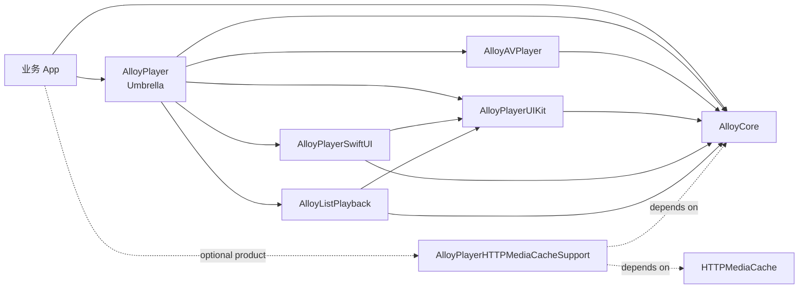

# AlloyPlayer

[](https://github.com/sunimp/AlloyPlayer/actions/workflows/ci.yml)
[](https://github.com/sunimp/AlloyPlayer/releases)
[](Package.swift)
[](Package.swift)
[](Package.swift)
[](LICENSE)

AlloyPlayer 是一个 Swift-only 的现代视频播放器框架。1.0.0 架构围绕纯播放核心、显式 `PlaybackSession` 状态机、UIKit 播放视图、SwiftUI 桥接和列表播放协调构建。默认播放入口不链接第三方缓存运行时，缓存等增强能力由可选 product 提供。

## 特性

- 纯 Swift Package Manager 分发，核心模块可按需组合。
- 内置 AVFoundation 播放引擎，也可以自行实现 `PlaybackEngine`。
- 使用 `PlaybackSession` 统一驱动播放状态、事件和用户控制命令。
- 内置 UIKit 播放视图和控制层，也可以自行实现 `UIKitControlOverlay`。
- 支持竖屏全屏、横屏全屏、自动旋转、锁定方向和自定义转场。
- 支持单击、双击、拖动、捏合、长按等播放器手势。
- 支持 ScrollView、TableView、CollectionView 列表播放和浮动画中画窗口。
- 播放状态、加载状态、播放时间、缓冲时间、错误和尺寸变化均通过快照与事件发布。
- 支持缓冲提示、音量/亮度 HUD、网速显示和自定义状态栏。
- 可通过可选 product 接入 [HTTPMediaCache](https://github.com/sunimp/HTTPMediaCache.git) 等缓存能力，默认播放入口保持轻量。
- 支持 iOS 播放场景，并提供 macOS Swift Package 测试宿主。

## 环境要求

- iOS 15.0+
- macOS 12.0+（Swift Package 测试宿主）
- SwiftPM 5.10+
- Xcode 16.0+

## 安装

在 `Package.swift` 中添加依赖：

```swift
.package(url: "https://github.com/sunimp/AlloyPlayer.git", from: "1.0.0")
```

完整播放器能力可以直接添加 `AlloyPlayer`：

```swift
.target(
    name: "YourApp",
    dependencies: [
        .product(name: "AlloyPlayer", package: "AlloyPlayer"),
    ]
)
```

UIKit 调用方可以只添加 `AlloyPlayerUIKit`：

```swift
.target(
    name: "YourApp",
    dependencies: [
        .product(name: "AlloyPlayerUIKit", package: "AlloyPlayer"),
    ]
)
```

SwiftUI 调用方可以只添加 `AlloyPlayerSwiftUI`：

```swift
.target(
    name: "YourApp",
    dependencies: [
        .product(name: "AlloyPlayerSwiftUI", package: "AlloyPlayer"),
    ]
)
```

如果需要高级组合，可以只引入底层产品：

```swift
.target(
    name: "YourApp",
    dependencies: [
        .product(name: "AlloyCore", package: "AlloyPlayer"),
        .product(name: "AlloyAVPlayer", package: "AlloyPlayer"),
    ]
)
```

需要 [HTTPMediaCache](https://github.com/sunimp/HTTPMediaCache.git) 缓存播放时，在同一个 AlloyPlayer package 中额外选择缓存支持 product：

```swift
.target(
    name: "YourApp",
    dependencies: [
        .product(name: "AlloyPlayer", package: "AlloyPlayer"),
        .product(name: "AlloyPlayerHTTPMediaCacheSupport", package: "AlloyPlayer"),
    ]
)
```

## 迁移指南

从旧版 API 升级时，破坏性变更和 old-to-new 示例见 [迁移指南](docs/MigrationGuide.md)。

## 快速开始

创建播放器视图并加载视频源：

```swift
import AlloyPlayer
import UIKit

final class PlayerViewController: UIViewController {
    private lazy var playerView = AlloyPlayerView(
        source: PlaybackSource(url: URL(string: "https://example.com/video.mp4")!)
    )

    override func viewDidLoad() {
        super.viewDidLoad()

        playerView.translatesAutoresizingMaskIntoConstraints = false
        view.addSubview(playerView)

        NSLayoutConstraint.activate([
            playerView.leadingAnchor.constraint(equalTo: view.leadingAnchor),
            playerView.trailingAnchor.constraint(equalTo: view.trailingAnchor),
            playerView.topAnchor.constraint(equalTo: view.safeAreaLayoutGuide.topAnchor),
            playerView.heightAnchor.constraint(equalTo: playerView.widthAnchor, multiplier: 9.0 / 16.0),
        ])
    }
}
```

监听播放状态：

```swift
session.statePublisher
    .sink { snapshot in
        print("playback state:", snapshot.engine.playbackState)
        print("current:", snapshot.engine.currentTime, "total:", snapshot.engine.duration)
    }
    .store(in: &cancellables)

session.eventPublisher
    .sink { event in
        print("playback event:", event)
    }
    .store(in: &cancellables)
```

## HTTPMediaCache 缓存播放

[HTTPMediaCache](https://github.com/sunimp/HTTPMediaCache.git) 支持由 `AlloyPlayerHTTPMediaCacheSupport` 可选 product 提供。业务传入原始 URL，支持层会启动本地代理、生成代理 URL，并交给播放器播放：

```swift
import AlloyPlayerHTTPMediaCacheSupport
import AlloyPlayer

let originalURL = URL(string: "https://example.com/video.mp4")!
let configuration = AlloyPlayerHTTPMediaCacheConfiguration(
    requestHeaders: [
        "Authorization": "Bearer token",
    ]
)

let source = PlaybackSource(url: originalURL)
let proxySource = try await AlloyPlayerHTTPMediaCacheSupport.proxySource(
    for: source,
    configuration: configuration
)
playerView.load(proxySource)
```

如果业务只需要代理 URL，也可以从代理播放源中读取：

```swift
let proxySource = try await AlloyPlayerHTTPMediaCacheSupport.proxySource(
    for: PlaybackSource(url: originalURL),
    configuration: .default
)
print("proxy URL:", proxySource.url)
```

AVPlayer 访问的是本地代理 URL，源站请求由 HTTPMediaCache 发出。鉴权、追踪等源站请求头应通过扩展包配置显式下发到下载链路。

## SwiftUI

`AlloySwiftUIPlayerView` 提供开箱即用的 SwiftUI 播放器视图：

```swift
import AlloyPlayer
import SwiftUI

struct PlayerScreen: View {
    let source: PlaybackSource

    var body: some View {
        AlloySwiftUIPlayerView(source: source)
            .aspectRatio(16.0 / 9.0, contentMode: .fit)
    }
}
```

需要外部控制或自定义控制层时：

```swift
struct CustomPlayerScreen: View {
    @StateObject private var controller: AlloyPlayerController

    init(url: URL) {
        _controller = StateObject(
            wrappedValue: AlloyPlayerController(source: PlaybackSource(url: url))
        )
    }

    var body: some View {
        AlloySwiftUIPlayerView(controller: controller) { controller in
            Button(controller.state.engine.playbackState == .playing ? "暂停" : "播放") {
                if controller.state.engine.playbackState == .playing {
                    controller.pause()
                } else {
                    controller.play()
                }
            }
        }
    }
}
```

## 列表播放

TableView / CollectionView 场景使用 `AlloyListPlayback` 选择最适合播放的可见项，再驱动 `AlloyPlayerUIKit.AlloyPlayerView` 播放：

```swift
import AlloyPlayer
import UIKit

final class ListPlayerViewController: UIViewController, UITableViewDelegate {
    private lazy var playerView = AlloyPlayerUIKit.AlloyPlayerView()
    private var listPlayback: ListPlaybackCoordinator!
    @IBOutlet private var tableView: UITableView!

    override func viewDidLoad() {
        super.viewDidLoad()

        playerView.controlOverlay = DefaultControlOverlay()
        listPlayback = ListPlaybackCoordinator(playerView: playerView)
    }

    func tableView(_ tableView: UITableView, didSelectRowAt indexPath: IndexPath) {
        guard let cell = tableView.cellForRow(at: indexPath) else { return }
        let url = URL(string: "https://example.com/video\(indexPath.row).mp4")!
        let candidate = ListPlaybackCandidate(
            id: indexPath.description,
            frame: cell.frame,
            source: PlaybackSource(url: url)
        )
        _ = listPlayback.update(
            candidates: [candidate],
            viewport: tableView.bounds,
            containerProvider: { _ in cell.contentView }
        )
    }

    func scrollViewDidEndDecelerating(_ scrollView: UIScrollView) {
        let visibleItems = tableView.indexPathsForVisibleRows?.compactMap { indexPath -> (ListPlaybackCandidate, UIView)? in
            guard let cell = tableView.cellForRow(at: indexPath) else { return nil }
            let frame = tableView.convert(cell.frame, to: tableView.superview)
            let url = URL(string: "https://example.com/video\(indexPath.row).mp4")!
            return (
                ListPlaybackCandidate(id: indexPath.description, frame: frame, source: PlaybackSource(url: url)),
                cell.contentView
            )
        } ?? []

        let viewport = tableView.convert(tableView.bounds, to: tableView.superview)
        listPlayback.configuration.minimumVisiblePercent = 0.5
        _ = listPlayback.update(
            candidates: visibleItems.map { $0.0 },
            viewport: viewport,
            containerProvider: { selected in
                visibleItems.first(where: { $0.0 == selected })?.1
            }
        )
    }
}
```

## 项目架构



模块职责：

| 模块 | 描述 |
|------|------|
| `AlloyCore` | 平台无关的播放类型、引擎协议、状态快照、事件和 `PlaybackSession` |
| `AlloyAVPlayer` | 基于 AVFoundation 的 `PlaybackEngine` 实现 |
| `AlloyPlayerUIKit` | UIKit 播放视图、默认控制层、手势和全屏协调 |
| `AlloyPlayerSwiftUI` | SwiftUI 播放器视图、默认 SwiftUI 控制层和外部控制句柄 |
| `AlloyListPlayback` | 列表播放协调器和浮动播放协调器 |
| `AlloyPlayer` | Umbrella 模块，重新导出 Core、AV、UIKit、SwiftUI 和 ListPlayback 能力 |

## 截图

| 基础播放 | 短视频 | 播放配置 |
|:---:|:---:|:---:|
|  |  |  |

| 横屏全屏 | 竖屏全屏 | 自定义控制层 |
|:---:|:---:|:---:|
|  |  |  |

## 示例工程

仓库内置 `Example/AlloyPlayerDemo.xcodeproj`，覆盖基础播放、短视频滑动、播放配置、列表播放、全屏模式、自定义控制层、SwiftUI 控制层和 HTTPMediaCache 缓存播放开关。

```bash
open Example/AlloyPlayerDemo.xcodeproj
```

## 测试

```bash
swift test
```

## 致谢

AlloyPlayer 的设计参考了以下开源项目的能力边界与使用经验：

- [ZFPlayer](https://github.com/renzifeng/ZFPlayer)

## 许可证

AlloyPlayer 基于 [MIT 许可证](LICENSE) 开源。
