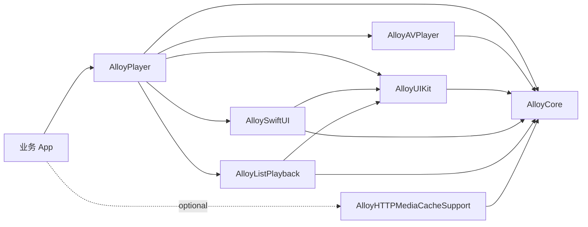

# AlloyPlayer 1.0.0 架构

AlloyPlayer 1.0.0 将播放能力拆成平台无关核心、具体播放引擎、UIKit 承载层、SwiftUI 桥接层、列表播放和可选缓存支持。模块之间只按单向依赖连接，核心层不依赖 UIKit、SwiftUI 或 AVFoundation。

## 模块职责

| 模块 | 职责 |
|------|------|
| `AlloyCore` | `PlaybackSource`、`PlaybackEngine`、`PlaybackSession`、状态快照、播放事件和基础工具 |
| `AlloyAVPlayer` | AVFoundation 引擎实现、状态机、观察逻辑和渲染 surface |
| `AlloyUIKit` | 播放器视图、默认控制层、手势控制和全屏协调 |
| `AlloySwiftUI` | SwiftUI 播放视图、控制器和默认 SwiftUI 控制层 |
| `AlloyListPlayback` | 列表候选选择、播放器视图挂载和浮动播放协调 |
| `AlloyHTTPMediaCacheSupport` | 把原始 `PlaybackSource` 转换为 HTTPMediaCache 代理播放源 |
| `AlloyPlayer` | Umbrella 重新导出和默认 AVFoundation session 工厂 |

## 公开入口

| 场景 | 入口 |
|------|------|
| 默认 AVFoundation 播放 | `AlloyPlayerFactory.makeDefaultSession()` |
| 自定义播放引擎 | `PlaybackEngine` + `PlaybackSession(engine:)` |
| UIKit 播放视图 | `AlloyUIKit.AlloyPlayerView` |
| UIKit 默认控制层 | `DefaultControlOverlay` |
| UIKit 自定义控制层 | `UIKitControlOverlay` + `PlaybackControlAction` |
| SwiftUI 播放视图 | `AlloyPlayerController` + `AlloySwiftUIPlayerView` |
| 列表播放 | `ListPlaybackCoordinator` + `ListPlaybackCandidate` |
| 浮动播放 | `FloatingPlaybackCoordinator` |
| HTTPMediaCache | `AlloyHTTPMediaCacheSupport.proxySource(for:configuration:)` |

`RenderHostView`、`FloatingPlaybackView`、`VisibilityEvaluator`、`KVOManager` 和内部 logger 不是公开扩展点。业务侧应通过上表入口接入。

## 主路径

1. 调用方创建 `PlaybackSession`，通常通过 `AlloyPlayerFactory.makeDefaultSession()`。
2. UIKit 调用方创建 `AlloyUIKit.AlloyPlayerView(session:)`，SwiftUI 调用方创建 `AlloyPlayerController(session:)` 和 `AlloySwiftUIPlayerView`。
3. 调用方传入 `PlaybackSource`。
4. `PlaybackSession` 将命令转发到 `PlaybackEngine`，并把引擎快照折叠成 `PlaybackStateSnapshot`。
5. 控制层只消费快照和事件，通过 `PlaybackControlAction` 发回用户动作。

## 设计边界

- `AlloyCore` 不出现 UIKit、SwiftUI、AVFoundation 或 Network 依赖。
- 播放引擎不持有 UI 控件，只暴露 `PlaybackRenderSurface`。
- UIKit 控制层不直接操作引擎，所有用户动作都通过 `actionHandler` 交给播放器视图或 session。
- 列表播放只负责候选选择和视图挂载，不拥有播放状态机。
- 缓存支持层只负责生成代理播放源，不隐式修改播放器状态。
